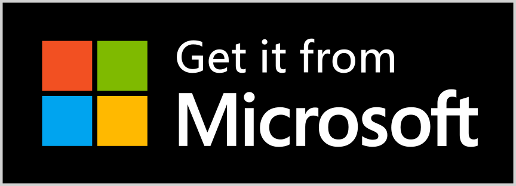

# LosslessCut 🎥  [](https://paypal.me/mifino)

**The swiss army knife of lossless video/audio editing**

LosslessCut aims to be the ultimate cross platform ffmpeg GUI for extremely fast and lossless operations on video, audio, subtitle and other related media files.
The main feature is lossless trimming and cutting of video and audio files, which is great for saving space by rough-cutting your large video files taken from a video camera, GoPro, drone, etc. It lets you quickly extract the good parts from your videos and discard many gigabytes of data without doing a slow re-encode and thereby losing quality. Or you can add a music or subtitle track to your video without needing to encode. Everything is extremely fast because it does an almost direct data copy, fueled by the awesome ffmpeg which does all the grunt work.


[LosslessCut app introduction](https://mifi.no/losslesscut)

## Features
- Lossless cutting of most video and audio formats
- Losslessly cut out parts of video/audio (for cutting away commercials etc.)
- Lossless merge/concatenation of arbitrary files (with identical codecs parameters, e.g. from same camera)
- Lossless stream editing: Combine arbitrary tracks from multiple files (ex. add music or subtitle track to a video file)
- Losslessly extract all tracks from a file (extract video, audio, subtitle and other tracks from one file into separate files)
- Remux into any compatible output format
- Take full-resolution snapshots from videos in JPEG/PNG format
- Manual input of cutpoint times
- Apply a per-file timecode offset
- Change rotation/orientation metadata in videos
- View technical data about all streams
- Timeline zoom and frame/keyframe jumping for accurate cutting around keyframes
- Saves per project cut segments to project file
- View ffmpeg last command log so you can modify and re-run recent commands on the command line
- Undo/redo
- Give labels to cut segments
- View segment details, export/import cut segments as CSV
- Video thumbnails and audio waveform

## Example lossless use cases

### Remove audio tracks from a file

### Add music to a video (or replace existing audio track)

### Link audio and video tracks from separate recordings

### Include a subtitle into a video

### Extract music track from a video and cut it to your needs

### Cut out commercials from a recorded TV show

Without having to re-encode. You can also change format from TS to MP4 at the same time.

### Fix rotation of a video that has the wrong orientation flag set

Great for rotating phone videos that come out the wrong way without actually re-encoding the video.

### Quickly change a H264 MKV video to MOV or MP4 for playback on iPhone

### Import a list of cut times from other tool as a EDL (edit decision list, CSV) and run these cuts with LosslessCut

### Export a list of cut times as a CSV EDL and run these in another tool

### Loop a video / audio clip X times quickly without re-encoding
See [#284](https://github.com/mifi/lossless-cut/issues/284)

### Advanced multi-step workflows

**Tip:** you can use LosslessCut in multiple passes in order to achieve separate trimming of individual tracks:
1. Open a file an export all tracks
2. Open the exported track files independently and cut them as desired
3. Add the track back to the video and combine them to one output video

## Download

If you want to support my continued work on LosslessCut, and want the advantage of a secure and simple installation process with automatic updates, consider getting it from your favorite store:

<a href="https://apps.apple.com/app/id1505323402"></a> <a href="https://www.microsoft.com/store/apps/9P30LSR4705L?cid=storebadge&ocid=badge"></a> <a href="https://snapcraft.io/losslesscut"></a>

If you prefer to download the executables manually, this will of course always be free:

- [Mac OS X](https://github.com/mifi/lossless-cut/releases/latest/download/LosslessCut-mac.dmg)
- [Windows](https://github.com/mifi/lossless-cut/releases/latest/download/LosslessCut-win.exe)
- [Linux tar.bz2](https://github.com/mifi/lossless-cut/releases/latest/download/LosslessCut-linux.tar.bz2)
- [More releases](https://github.com/mifi/lossless-cut/releases)

If you find LosslessCut useful, I'm very thankful for [donations](https://github.com/mifi/lossless-cut#donate-).

## Supported formats

Since LosslessCut is based on Chromium and uses the HTML5 video player, not all ffmpeg supported formats will be supported smoothly.
The following formats/codecs should generally work: MP4, MOV, WebM, MKV, OGG, WAV, MP3, AAC, H264, Theora, VP8, VP9
For more information about supported formats / codecs, see https://www.chromium.org/audio-video.

Unsupported files can still be converted to a supported format/codec from the `File` menu. (Try fastest variant first.) A low quality version of the file (without audio) will then be created and opened in the player. The cut/export operation will still be performed on the original file, so it will be lossless. This allows for potentially opening any file that ffmpeg is able to decode.

## How to use

[Watch tutorial video](https://www.youtube.com/watch?v=pYHMxXy05Jg)

### Typical workflow

- Drag drop a video file into player or use <kbd>⌘</kbd>/<kbd>CTRL</kbd>+<kbd>O</kbd>.
- Press <kbd>SPACE</kbd> to play/pause or <kbd>◀</kbd><kbd>▶</kbd>, <kbd>,</kbd><kbd>.</kbd> or mouse/trackpad wheel to seek back/forth
- Select the cut segment's start and end time by moving the time marker and then pressing <kbd>I</kbd> to set start time, and <kbd>O</kbd> to set end time.
  - Note that the segments you select will be **preserved** and exported to a new file. You can change this behavior with the **Yin Yang** symbol ☯️, in which case it will instead **remove** all selected segments and export the parts between.
  - Note also that start time will not be accurate, see [Known issues](#known-issues--limitations)
- *(optional)* If you want to add more than one segment, move to the desired start time and press <kbd>+</kbd>, then select the next segment start/end times with <kbd>I</kbd>/<kbd>O</kbd>.
- *(optional)* If you want to re-merge all the selected segments into one file after cutting, toggle the button `Separate files` to `Merge cuts`.
- *(optional)* If you want to export to a certain output folder, press the `Working dir unset` button (default: Input file folder)
- *(optional)* If you want to change orientation, press the **rotation** button
- *(optional)* By default, audio, video and subtitle tracks from the input file will be cut and exported. Press the `Tracks` button to customise and/or add new tracks from other files.
- *(optional)* select a new output format
- Press the `Export` button (or <kbd>E</kbd>) to run the export
- Press the **Camera** button (or <kbd>C</kbd>) if you want to take a JPEG/PNG snapshot from the current time
- If you want to move the original file to trash, press the **trash** button
- For best results you may need to trial and error with another output format (matroska takes nearly everything), change keyframe cut mode or disable some tracks, see known issues below.

Note: The original video file will not be modified. Instead it creates a lossless export to a new file in the same directory as the original file with from/to timestamps.

Note also that the cut is currently not precise around the cutpoints, so video before/after the nearest keyframe will be discarded. EXIF metadata is preserved.

## Known issues & limitations

- **Cutting times are not accurate!** Start cut time will be "rounded" to the nearest **previous** keyframe.
  - Lossless cutting is not an exact science. For some codecs it just works. For others you may need to trial and error depending on the codec, keyframes etc to get the best cut. See [#330](https://github.com/mifi/lossless-cut/issues/330)
  - Your mileage may vary when it comes to `Keyframe cut` vs `Normal cut`. You may need to try both, depending on the video. [ffmpeg](https://trac.ffmpeg.org/wiki/Seeking) also has documentation about these two seek/cut modes. `Keyframe cut` means `-ss` *before* `-i` and `Normal cut` means `-ss` *after* `-i`.
- When exporting you may lose some proprietary data tracks (like `tmcd`, `fdsc` and `gpmd` added by GoPro). These can be exported to separate files however
- Some codecs are not supported natively. There is partial support with low quality. You can convert to supported codec from the menu, see [#88](https://github.com/mifi/lossless-cut/issues/88)

## Troubleshooting

- If you get an error when cutting or opening any kind of file under Windows, try to disable your anti-virus. See [#18](https://github.com/mifi/lossless-cut/issues/18)
- If you get an error on Linux like `FATAL:setuid_sandbox_host.cc(157)] The SUID sandbox helper binary was found, but is not configured correctly. Rather than run without sandboxing I'm aborting now.`, try to run it as `./lossless-cut --no-sandbox`. See #258
- If any other problem, check [Known issues](#known-issues--limitations), or please search for existing issues before you file an issue here on GitHub.

## CSV import/export

The CSV export/import function takes csv files with one cut segment on each line. Each line contains three columns: `segment start`, `segment end`, `label`.

`segment start` and `segment end` are expressed in seconds or left empty. Empty `segment end` means segment ends at the duration of the video.

Note that you must use comma `,` to separate the fields (not semicolon `;`)

### example.csv
```csv
,56.9568,First segment starting at 0
70,842.33,"Another quoted label"
1234,,Last segment
```

## Shameless Plug

- I made a command line video editor with slick transitions and lots of colors! [editly](https://github.com/mifi/editly)
- I made a tool for cross platform sharing of files between computer/phone over the local network: [ezshare](https://github.com/mifi/ezshare)

## Donate 🙈

This project is maintained by me alone. The project will always remain free and open source, but if it's useful for you, consider supporting me. :) It will give me extra motivation to improve it. Or even better [donate to ffmpeg](https://www.ffmpeg.org/donations.html) because they are doing the world a big favor 🙏

[Paypal](https://paypal.me/mifino)

## Attributions
- App icon made by [Dimi Kazak](http://www.flaticon.com/authors/dimi-kazak "Dimi Kazak") from [www.flaticon.com](http://www.flaticon.com "Flaticon") is licensed by [CC 3.0 BY](http://creativecommons.org/licenses/by/3.0/ "Creative Commons BY 3.0")
- [Lottie animation](https://lottiefiles.com/7077-magic-flow)
- Thanks to Adi Abinun for his UI sketch work, inspiration and guidance
- Thanks to everyone who support my continued open source work 🙌
- Thanks to translators who helped translate the app. [You can too!](https://hosted.weblate.org/projects/losslesscut/losslesscut/)

---

Made with ❤️ in 🇳🇴

More apps by [mifi.no](https://mifi.no/)