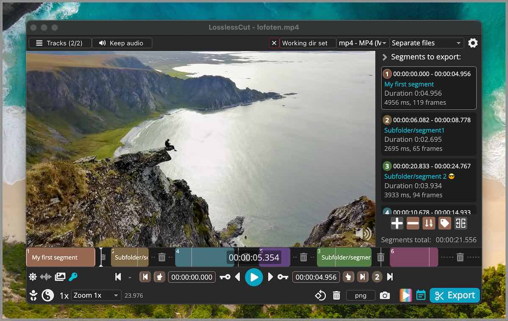

	 
  

  
<b>LosslessCut</b>

  The swiss army knife of lossless video/audio editing
	 
  
     
	 
	 
  <a href="https://mifi.no/thanks/">Thanks to my supporters</a> and everyone who purchased LosslessCut!
	 
	 
  

	 
	 

LosslessCut aims to be the ultimate cross platform FFmpeg GUI for extremely fast and lossless operations on video, audio, subtitle and other related media files.
The main feature is lossless trimming and cutting of video and audio files, which is great for saving space by rough-cutting your large video files taken from a video camera, GoPro, drone, etc. It lets you quickly extract the good parts from your videos and discard many gigabytes of data without doing a slow re-encode and thereby losing quality. There are also many more [use cases](#typical-workflow). Everything is extremely fast because it does an almost direct data copy, fueled by the awesome FFmpeg which does all the grunt work.

## Table of contents

- [Features](#features)
- [Example lossless use cases](#example-lossless-use-cases)
- [Download](#download)
- [Supported formats](#supported-formats)
- [Typical workflow](#typical-workflow)
- [Video demos](#video-demos)
- [Featured](#featured)
- [Attributions](#attributions)
- [More documentation](#more-documentation)

## Features

- Lossless cutting of most video and audio formats
- [Smart cut](https://github.com/mifi/lossless-cut/issues/126) (experimental)
- Losslessly cut out parts of video/audio (for cutting away commercials etc.)
- Losslessly rearrange the order of video/audio segments
- Lossless merge/concatenation of arbitrary files (with identical codecs parameters, e.g. from the same camera)
- Lossless stream editing
  - Combine arbitrary tracks from multiple files (ex. add music or subtitle track to a video file)
  - Remove unneeded tracks
  - Replace or re-encode only some tracks
  - Extract all tracks from a file (extract video, audio, subtitle, attachments and other tracks from one file into separate files)
- Fast multi-file workflow (note: no mass/batch export yet)
- Keyboard shortcut workflow
- Losslessly remux video/audio into a different container (file) format
- Take full-resolution snapshots from videos in JPEG/PNG format (low or high quality)
- Export ranges of video frames to images (every nth frame, second, by scene change, best thumbnails)
  - Export only from a selected time range (segment)
  - Optionally include original timestamps in image file names
- Manual input of cutpoint times
- Apply a per-file timecode offset (and auto load timecode from file)
- Edit file metadata, per-track metadata and per-track disposition
- Change rotation/orientation metadata in videos
- View technical data about all tracks
- Timeline zoom and frame/keyframe jumping for cutting around keyframes
- Video thumbnails and audio waveform
- Saves per project cut segments to project file
- View FFmpeg last command log so you can modify and re-run recent commands on the command line
- Undo/redo
- Give labels to cut segments
- Annotate segments with tags
- [Import/export](import-export.md) segments: MP4/MKV chapter marks, Text file, YouTube, CSV, CUE, XML (DaVinci, Final Cut Pro) and more
- MKV/MP4 embedded chapters marks editor
- View subtitles
- Customizable keyboard hotkeys
- Black scene detection, silent audio detection, and scene change detection
- Divide timeline into segments with length L or into N segments or even randomized segments!
- Speed up / slow down video or audio file ([changing FPS](https://github.com/mifi/lossless-cut/issues/1712))
- Basic [CLI](cli.md) and [HTTP API](api.md)
- Show (DJI) embedded GPS track on a map
- Losslessly Download videos over HTTP (e.g. HLS `.m3u8`)

## Example lossless use cases

- Cut out commercials from a recorded TV show (and re-format from TS to MP4)
- Remove audio tracks from a file
- Extract music track from a video and cut it to your needs
- Add music to a video (or replace existing audio track)
- Combine audio and video tracks from separate recordings
- Include an external subtitle into a video
- Quickly change a H264/H265 MKV video to MOV or MP4 for playback on iPhone
- Import a list of cut times from other tool as a EDL (edit decision list, CSV) and run these cuts with LosslessCut
- Export a list of cut times as a CSV EDL and process these in another tool
- Quickly cut a file by its MP4/MKV chapters
- Quickly cut a [YouTube video](https://youtube-dl.org/) by its chapters (or music times from a comment)
- Change the language of a file's audio/subtitle tracks
- Attach cover art / thumbnail to videos / audio from an external JPEG file or from a frame on the timeline
- Change author, title, GPS position, recording time of a video
- Fix rotation of a video that has the wrong orientation flag set
  - Great for rotating phone videos that come out the wrong way without actually re-encoding the video.
- Loop a video / audio clip X times quickly without re-encoding
  - See [#284](https://github.com/mifi/lossless-cut/issues/284)
- Convert a video or parts of it into X image files (not lossless)
- Losslessly split a video into one file per scene (note you probably have to shift segments, see [#330](https://github.com/mifi/lossless-cut/issues/330).)
- Cut away silent parts of an audio/video
- Split video into segments to for example respect Twitter's 140 second limit
- Annotate each segment with one or more tags, then use those tags to organize your segments or use it to create an output folder structure or hierarchy for your segments.

### Export cut times as YouTube Chapters
1. Export with Merge and "Create chapters from merged segments" enabled
2. Open the exported file and select "Import chapters" in the dialog
3. File -> Export project -> YouTube Chapters

### Re-encode only the audio track, keeping the lossless video track

First export each track as individual files. Then use Handbrake or similar to re-encode the audio file (if mp4 file, encode as AAC.) Then open the extracted video stream in LosslessCut. The open your encoded audio file and select "Include all tracks from the new file". Then export.

### Advanced multi-step workflows

**Tip:** you can use LosslessCut in multiple passes in order to achieve separate trimming of individual tracks:
1. Open a file an export all tracks as individual files
2. Open the exported track files independently and cut them as desired
3. Add the track back to the video and combine them to one output video

## Download

If you want to support my continued work on LosslessCut, and you want the advantage of a secure and simple installation process with automatic, stable updates, consider getting it from your favorite store:

 

For Linux these are some alternatives:

 

If you prefer to download the executables manually, this will of course always be free (see also [supported operating systems](./requirements.md)):

- macOS: [Intel](https://github.com/mifi/lossless-cut/releases/latest/download/LosslessCut-mac-x64.dmg) / [Apple Silicon](https://github.com/mifi/lossless-cut/releases/latest/download/LosslessCut-mac-arm64.dmg) DMG (note that PKG does **not** work)
- Windows: [7zip](https://github.com/mifi/lossless-cut/releases/latest/download/LosslessCut-win-x64.7z) (Windows 7, 8 and 8.1 is [no longer supported](https://github.com/mifi/lossless-cut/discussions/1476) after [v3.50.0](https://github.com/mifi/lossless-cut/releases/tag/v3.50.0))
- Linux: [x64 tar.bz2](https://github.com/mifi/lossless-cut/releases/latest/download/LosslessCut-linux-x64.tar.bz2) / [x64 AppImage](https://github.com/mifi/lossless-cut/releases/latest/download/LosslessCut-linux-x86_64.AppImage) / [arm64 tar.bz2](https://github.com/mifi/lossless-cut/releases/latest/download/LosslessCut-linux-arm64.tar.bz2) / [Raspberry Pi armv7l](https://github.com/mifi/lossless-cut/releases/latest/download/LosslessCut-linux-armv7l.tar.bz2)
- [More releases](https://github.com/mifi/lossless-cut/releases) - Note that APPX (Windows) and PKG (macOS) do **not** work)
- [Latest nightly builds 🧪](https://mifi.no/llc/nightly/)

Difference between App Stores and GitHub download? [Please see FAQ](issues.md#app-stores-and-github-difference).

LosslessCut is maintained by me alone and will always remain free and open source. If it's useful to you, consider supporting my work. Alternatively [donate to FFmpeg](https://www.ffmpeg.org/donations.html) because they are doing the world a huge favor.

[Paypal](https://paypal.me/mifino/usd) | [crypto](https://mifi.no/thanks) | [more](https://mifi.no/thanks)

## Supported formats

LosslessCut uses the Chromium browser's HTML5 video player, and not all formats/codecs are [natively supported](https://www.chromium.org/audio-video). Generally, the following file formats work: `MP4`, `MOV`, `WebM`, `Matroska`, `OGG` and `WAV`. Audio codecs: `FLAC`, `MP3`, `Opus`, `PCM`, `Vorbis` and `AAC`. Video codecs: `H264`, `AV1`, `Theora`, `VP8`, `VP9` and `H265` (with hardware decoder). Learn the [difference between a codec and a format](./issues.md#primer-video--audio-formats-vs-codecs). Codecs and formats not listed above can still be converted to a supported format/codec from the `File` menu (try the option *Fastest: FFmpeg-assisted playback* first). A low quality version of the file will then be created and opened in the player. Note that the actual cut/export operation will still be performed on the original file, so it will be lossless. This allows for potentially opening any file that FFmpeg is able to decode.

## Typical workflow

- Drag drop a video file into player or use <kbd>⌘</kbd>/<kbd>CTRL</kbd>+<kbd>O</kbd>.
- Press <kbd>SPACE</kbd> to play/pause or <kbd>◀</kbd><kbd>▶</kbd>, <kbd>,</kbd><kbd>.</kbd> or mouse/trackpad wheel to seek back/forth.
- Select the cut segment's start and end time by moving the time marker and then pressing <kbd>I</kbd> to set start time, and <kbd>O</kbd> to set end time.
  - Note that all segments you create will be **preserved** and exported as new files. You can change this behavior with the **Yin Yang** symbol ☯️, in which case it will instead **remove** all selected segments and export the parts **between** segments.
  - Note also that start times will not be accurate, see [Known issues](issues.md)
- *(optional)* If you want to add more than one segment, move to the desired start time and press <kbd>+</kbd>, then select the next segment start/end times with <kbd>I</kbd>/<kbd>O</kbd>.
- *(optional)* If you want to re-merge all the selected segments into one file after cutting, toggle the button `Separate files` to `Merge cuts`.
- *(optional)* If you want to export to a certain output folder, press the `Working dir unset` button (default: Input file folder)
- *(optional)* If you want to change orientation, press the **rotation** button
- *(optional)* By default, audio, video and subtitle tracks from the input file will be cut and exported. Press the `Tracks` button to customise and/or add new tracks from other files.
- *(optional)* select a new output format
- *(optional)* In the right-hand segments panel, right click a segment for options, or drag-drop to reorder. Segments will appear in this order in the merged output.
- **When done, press the `Export` button (or <kbd>E</kbd>) to show an overview with export options.**
- *(optional)* adjust any export options
- **Then press `Export` again to confirm the export**
- Press the **Camera** button (or <kbd>C</kbd>) if you want to take a JPEG/PNG snapshot from the current time
- If you want to move the original file to trash, press the **trash** button
- For best results you may need to trial and error with another output format (Matroska takes nearly everything), change keyframe cut mode or disable some tracks (see [known issues](issues.md)).
- Press <kbd>SHIFT</kbd> + <kbd>/</kbd> to view all keyboard & mouse shortcuts.
- **Note:** The original video file will not be modified. Instead, a file is created file in the same directory as the original file with from/to timestamps in the file name.

### Video demos

- [Common features](https://www.youtube.com/watch?v=pYHMxXy05Jg)
- [How to add a thumbnail / cover art to an MP4](https://www.youtube.com/watch?v=4pYJ93cn80E)
- [How to add multi-language audio to a video](https://www.youtube.com/watch?v=MRBGDsuw_WU)
- Your video here?

## More documentation
- [Import / export](import-export.md)
- [Command line interface (CLI)](cli.md) & [HTTP API](api.md)
- [Known issues, limitations, troubleshooting, FAQ](issues.md)
- [Contributing](CONTRIBUTING.md)

## Featured

- [Console newsletter](https://console.substack.com/p/console-93)
- Hacker News [2024](https://news.ycombinator.com/item?id=40829494) [2022](https://news.ycombinator.com/item?id=33969490) [2020-10](https://news.ycombinator.com/item?id=24883030) [2020-01](https://news.ycombinator.com/item?id=22026412) [2016](https://news.ycombinator.com/item?id=12885585)
- [Wikipedia](https://en.m.wikipedia.org/wiki/LosslessCut)
- Your link here?

## Attributions
- App icon made by [Dimi Kazak](http://www.flaticon.com/authors/dimi-kazak "Dimi Kazak") from [www.flaticon.com](http://www.flaticon.com "Flaticon") is licensed by [CC 3.0 BY](http://creativecommons.org/licenses/by/3.0/ "Creative Commons BY 3.0").
- [Lottie animation by Chris Gannon](https://lottiefiles.com/7077-magic-flow).
- Thanks to Adi Abinun for UI work.
- Thanks to translators who helped translate the app. [You can too!](translation.md)
- [Thanks to everyone for supporting](https://mifi.no/thanks/) my open source work 🙌

---

Made with ❤️ in [🇳🇴](https://www.youtube.com/watch?v=uQIv8Vo9_Jc)

[More apps by mifi.no](https://mifi.no/)

Follow me on [GitHub](https://github.com/mifi/), [YouTube](https://www.youtube.com/channel/UC6XlvVH63g0H54HSJubURQA), [IG](https://www.instagram.com/mifi.no/), [Twitter](https://twitter.com/mifi_no) for more awesome content!
